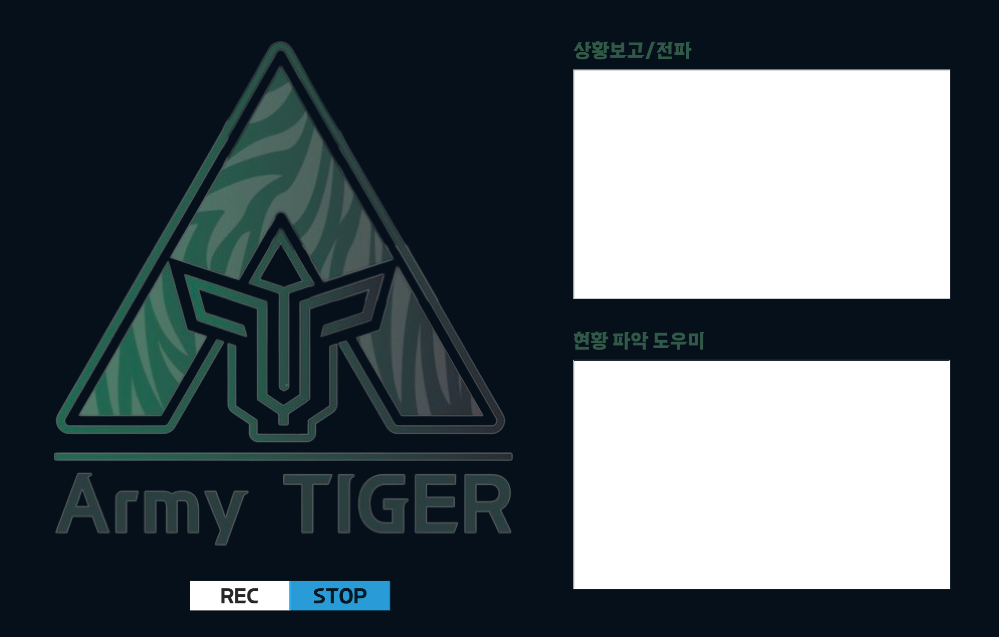

# ArmyTIGER_Develop
 AI 전투발전 제안 공모

# 2023 AI 전투발전 제안
> 음성인식 ATCIS 도우미 ArmyTIGER Assistant

누가 보고 하더라도 통일된 보고 양식으로, 다양한 보고 체계를 통합으로 보고/전파 할 수 있는 AI 음성인식 ATCIS 도우미

## 개발 환경

Mac OS

Python 3.9

Speech Recognition

## 시연 영상

아래 링크를 클릭하시면 시연 영상을 시청하실 수 있습니다.

_[실제상황 시연 영상][https://youtu.be/0q0WGzMn_7E]_

_[훈련상황 시연 영상][https://youtu.be/y0gQPNUuWg8]_

## 개발자 약력

1. 건국대학교 컴퓨터공학부 졸
2. IEIE SPC(SCOPUS) 딥러닝을 이용한 점진적 안개 제거와 장면 깊이 추정 논문 기고
3. 2022 국방부 AI 경진대회 4등